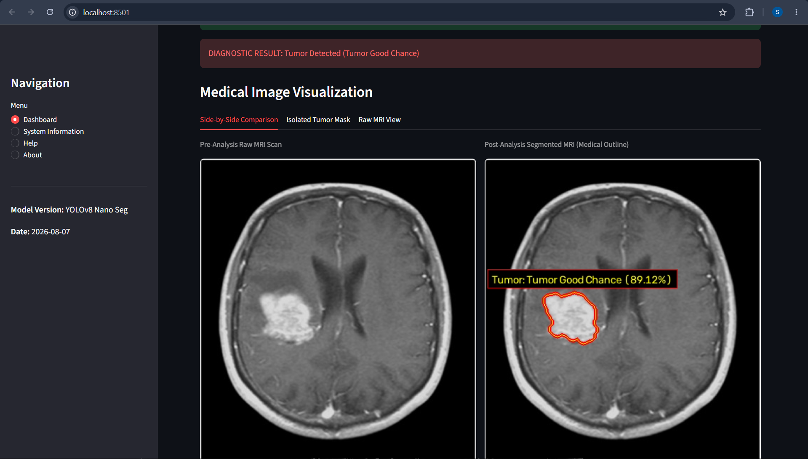
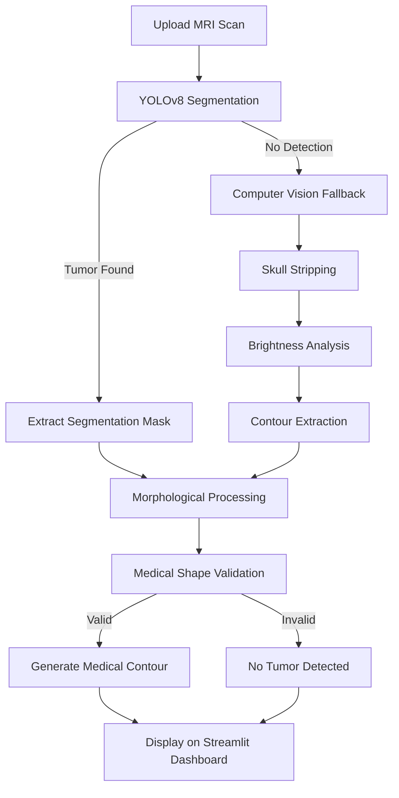

# 🧠 Brain Tumor Detection System

<div align="center">

### AI-Powered Brain MRI Tumor Segmentation using YOLOv8 & Computer Vision

<p align="center">
  
  
  
  
  
</p>

<p align="center">
A modern Artificial Intelligence application that detects and accurately segments brain tumors from MRI scans using Deep Learning and Computer Vision.
</p>

<p align="center">

<a href="https://cherishkumarsatpathy.me/" target="_blank">

</a>

</p>

</div>

---

# 📖 About The Project

Brain tumors are among the most critical neurological disorders that require early and accurate diagnosis. Traditional AI systems often detect tumors using rectangular bounding boxes, which provide limited medical information.

This project introduces an advanced **Brain Tumor Detection System** that performs **precise tumor segmentation** instead of simple object detection.

The application combines:

- **YOLOv8 Segmentation** for accurate tumor localization.
- **Computer Vision Fallback Pipeline** for improved robustness.
- **Morphological Validation** to reduce false positives.
- **Interactive Streamlit Dashboard** for real-time predictions.

The result is a lightweight, professional, and user-friendly medical imaging application suitable for educational, research, and portfolio purposes.

---

# 🖼 Dashboard Preview

<p align="center">

</p>

<p align="center">
<b>Figure:</b> AI-powered Streamlit dashboard showing MRI upload, tumor segmentation, diagnostic metrics, and prediction results.
</p>

---

# 🏗 System Architecture



---

# ✨ Features

- 🧠 AI-powered Brain MRI Tumor Detection
- 🎯 Exact Tumor Segmentation using YOLOv8
- 🔍 Computer Vision Fallback Detection
- 📈 Confidence Score Prediction
- 📊 Diagnostic Metrics Dashboard
- ⚡ Fast CPU Optimized Inference
- 🖥 Modern Streamlit User Interface
- 📂 Support for JPG and PNG MRI Images
- 📄 Download Reports (JSON, CSV & TXT)
- 🧮 Morphological Validation for Better Accuracy
- 🚀 Lightweight and Easy to Deploy

---

# 🚀 Technology Stack

| Category | Technology |
|-----------|------------|
| Programming Language | Python 3.10 |
| Deep Learning | Ultralytics YOLOv8 |
| Framework | PyTorch |
| Computer Vision | OpenCV |
| Dashboard | Streamlit |
| Numerical Computing | NumPy |
| Data Analysis | Pandas |
| Performance Monitoring | psutil |

---

# 📂 Project Structure

```text
Brain_Tumor_Detection/
│
├── models/
│   └── best.pt
│
├── ui/
│   └── app.py
│
├── utils/
│
├── outputs/
│
├── dashboard_screenshot.png
├── requirements.txt
├── README.md
└── ...
```

---

# ⚙ Installation

## 1. Clone the Repository

```bash
git clone https://github.com/Cherish01-spec/Brain_Tumor_Detection.git

cd Brain_Tumor_Detection
```

---

## 2. Create Virtual Environment

```bash
python -m venv venv
```

### Activate

Windows

```bash
venv\Scripts\activate
```

Linux / macOS

```bash
source venv/bin/activate
```

---

## 3. Install Dependencies

```bash
pip install torch torchvision torchaudio --index-url https://download.pytorch.org/whl/cpu

pip install ultralytics

pip install streamlit

pip install opencv-python

pip install pandas numpy psutil
```

---

## 4. Run the Application

```bash
streamlit run ui/app.py
```

---

# 📖 How To Use

1. Launch the Streamlit dashboard.
2. Upload a Brain MRI image.
3. Wait for the AI model to process the scan.
4. View:
   - Original MRI
   - Segmented MRI
   - Confidence Score
   - Diagnostic Metrics
5. Download the generated report if needed.

---

# 🔄 Detection Workflow

```text
Brain MRI
     │
     ▼
YOLOv8 Segmentation
     │
     ├────────► Tumor Found
     │
     ▼
Computer Vision Fallback
     │
     ▼
Morphological Validation
     │
     ▼
Tumor Contour Generation
     │
     ▼
Interactive Streamlit Dashboard
```

---

# 🎯 Advantages

- High-quality tumor segmentation
- Modern and intuitive interface
- Fast CPU inference
- Lightweight implementation
- Reduced false positives
- Easy deployment
- Professional project architecture
- Educational and research friendly

---

# 🔮 Future Improvements

- Multi-Class Brain Tumor Classification
- Tumor Volume Estimation
- DICOM Image Support
- PDF Medical Report Generation
- Explainable AI (Grad-CAM)
- 3D MRI Visualization
- Doctor Authentication Portal
- Patient Database Management
- Cloud Deployment

---

# 🌐 Portfolio

If you'd like to explore more of my projects or learn more about me, visit my portfolio.

<div align="center">

### 🌍 https://cherishkumarsatpathy.me/

</div>

---

# 👨‍💻 Author

**Cherish Kumar Satpathy**

B.Tech Computer Science & Engineering

Artificial Intelligence • Computer Vision • Deep Learning • Machine Learning

Portfolio: **https://cherishkumarsatpathy.me/**

---

# 📜 License

This project is intended for **educational, research, and portfolio demonstration purposes**.

Copyright © Cherish Kumar Satpathy.

Unauthorized copying, redistribution, modification, or commercial use of this project without prior written permission from the author is prohibited.

---

<div align="center">

## ⭐ If you found this project useful, consider giving it a Star!

### Thank you for visiting this repository.

**Made with ❤️ using Python, YOLOv8, OpenCV, Streamlit, and Deep Learning**

</div>

---

# 📸 How to Add Your Dashboard Screenshot

## Step 1

Rename your dashboard image exactly as:

```text
dashboard_screenshot.png
```

---

## Step 2

Move it into the root folder of your project.

Example:

```text
Brain_Tumor_Detection/
│
├── dashboard_screenshot.png
├── README.md
├── requirements.txt
├── ui/
├── models/
└── ...
```

---

## Step 3

Commit and push it to GitHub.

```bash
git add dashboard_screenshot.png README.md

git commit -m "Updated README and added dashboard screenshot"

git push origin main
```

If your repository uses **master** instead of **main**, replace `main` with `master`.

---

## Step 4

Refresh your GitHub repository page.

The dashboard image will automatically appear in the **Dashboard Preview** section of your README.
